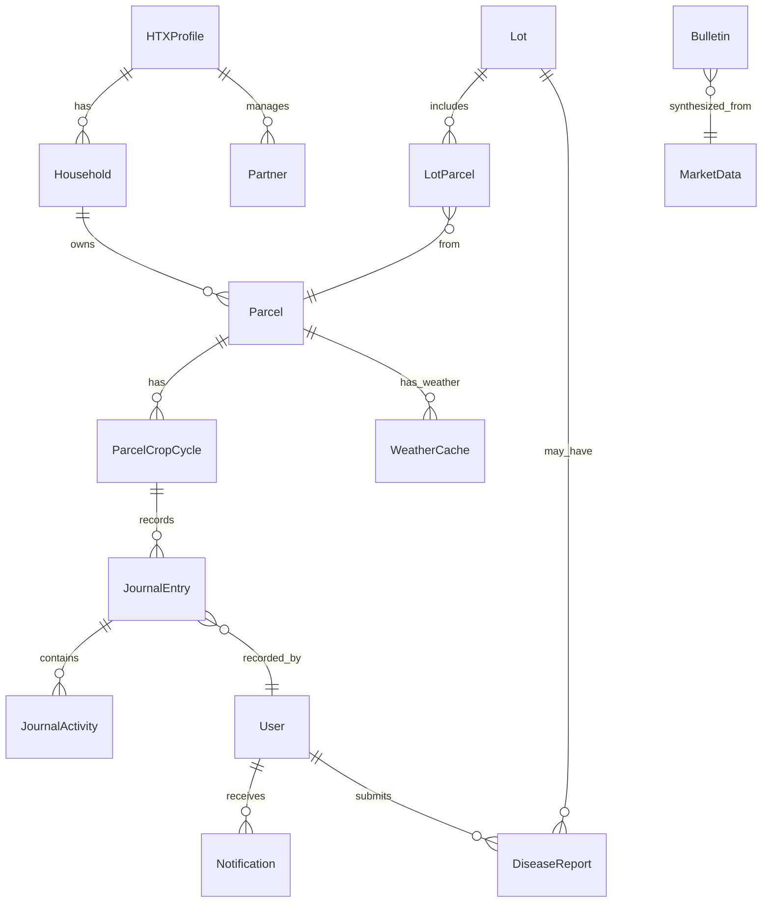

# Database Schema — DX-AgriMarket

**ORM:** Prisma 5.x · **DB:** PostgreSQL 16 · **Schema file:** `apps/web/prisma/schema.prisma`

> **Rule:** n8n is the ONLY writer to `market_data`, `weather_cache`, `bulletins`, `fx_rates` tables.
> All other tables are written by Next.js API routes via Prisma.

---

## ERD Overview



---

## Tables

### `htx_profiles`
HTX (Hợp tác xã) master profile. One record per deployment.

| Column | Type | Constraints | Description |
|--------|------|-------------|-------------|
| id | UUID | PK, default gen_random_uuid() | |
| htx_code | VARCHAR(20) | UNIQUE, NOT NULL | Mã HTX (dùng cho Lot code) |
| name | VARCHAR(200) | NOT NULL | Tên HTX |
| province | VARCHAR(100) | NOT NULL | Tỉnh/Thành phố |
| district | VARCHAR(100) | NOT NULL | Quận/Huyện |
| commune | VARCHAR(100) | NOT NULL | Xã/Phường |
| address_detail | TEXT | | Địa chỉ chi tiết |
| primary_crop | VARCHAR(100) | NOT NULL | Cây trồng chính |
| total_area_ha | DECIMAL(10,2) | | Tổng diện tích (ha) — auto-calc from parcels |
| member_count | INT | | Số thành viên — auto-calc from households |
| certification | VARCHAR(50) | | VietGAP / GlobalGAP / Organic |
| logo_minio_key | VARCHAR(500) | | MinIO object key cho logo |
| created_at | TIMESTAMPTZ | NOT NULL, DEFAULT now() | |
| updated_at | TIMESTAMPTZ | NOT NULL, DEFAULT now() | |

---

### `users`
Keycloak-linked user records. Synced on first login.

| Column | Type | Constraints | Description |
|--------|------|-------------|-------------|
| id | UUID | PK | Matches Keycloak subject ID |
| keycloak_id | VARCHAR(100) | UNIQUE, NOT NULL | Keycloak sub claim |
| email | VARCHAR(200) | UNIQUE, NOT NULL | |
| full_name | VARCHAR(200) | NOT NULL | |
| role | ENUM('manager','officer','farmer') | NOT NULL | Synced from Keycloak role |
| phone | VARCHAR(20) | | |
| household_id | UUID | FK → households, nullable | Nếu role = farmer |
| is_active | BOOLEAN | NOT NULL, DEFAULT true | |
| created_at | TIMESTAMPTZ | NOT NULL, DEFAULT now() | |
| updated_at | TIMESTAMPTZ | NOT NULL, DEFAULT now() | |

**Indexes:** `keycloak_id`, `email`, `role`

---

### `households`
Nông hộ thành viên HTX.

| Column | Type | Constraints | Description |
|--------|------|-------------|-------------|
| id | UUID | PK | |
| htx_profile_id | UUID | FK → htx_profiles, NOT NULL | |
| household_code | VARCHAR(50) | UNIQUE, NOT NULL | Mã nông hộ |
| owner_name | VARCHAR(200) | NOT NULL | Tên chủ hộ |
| phone | VARCHAR(20) | | |
| address | TEXT | | |
| total_area_ha | DECIMAL(10,2) | | Auto-calc từ parcels của hộ |
| created_at | TIMESTAMPTZ | NOT NULL, DEFAULT now() | |
| updated_at | TIMESTAMPTZ | NOT NULL, DEFAULT now() | |

---

### `parcels`
Thửa đất (land parcel). Mỗi hộ có nhiều thửa.

| Column | Type | Constraints | Description |
|--------|------|-------------|-------------|
| id | UUID | PK | |
| household_id | UUID | FK → households, NOT NULL | |
| parcel_code | VARCHAR(50) | UNIQUE, NOT NULL | Mã thửa |
| name | VARCHAR(200) | | Tên thửa (tự đặt) |
| area_ha | DECIMAL(10,4) | NOT NULL | Diện tích (ha) — Turf.js calculated |
| geojson | JSONB | NOT NULL | GeoJSON polygon từ Leaflet.draw |
| centroid_lat | DECIMAL(10,7) | NOT NULL | Tâm thửa — cho Open-Meteo query |
| centroid_lng | DECIMAL(10,7) | NOT NULL | |
| status | ENUM('idle','growing','harvested','fallow') | NOT NULL, DEFAULT 'idle' | |
| current_crop | VARCHAR(100) | | Cây trồng đang canh tác |
| soil_type | VARCHAR(100) | | Loại đất |
| irrigation_type | VARCHAR(100) | | Tưới tiêu |
| created_at | TIMESTAMPTZ | NOT NULL, DEFAULT now() | |
| updated_at | TIMESTAMPTZ | NOT NULL, DEFAULT now() | |

**Indexes:** `household_id`, `status`, `(centroid_lat, centroid_lng)`

---

### `parcel_crop_cycles`
Vụ mùa của thửa đất. Mỗi thửa có thể nhiều vụ.

| Column | Type | Constraints | Description |
|--------|------|-------------|-------------|
| id | UUID | PK | |
| parcel_id | UUID | FK → parcels, NOT NULL | |
| season | VARCHAR(50) | NOT NULL | Vụ Đông Xuân / Hè Thu / Vụ Mùa |
| crop | VARCHAR(100) | NOT NULL | Cây trồng vụ này |
| planting_date | DATE | NOT NULL | |
| estimated_harvest_date | DATE | | |
| actual_harvest_date | DATE | | |
| estimated_yield_kg | DECIMAL(10,2) | | Sản lượng ước tính |
| actual_yield_kg | DECIMAL(10,2) | | Sản lượng thực tế |
| is_active | BOOLEAN | NOT NULL, DEFAULT true | |
| created_at | TIMESTAMPTZ | NOT NULL, DEFAULT now() | |

---

### `journal_entries`
Nhật ký canh tác. Officer ghi, Manager duyệt.

| Column | Type | Constraints | Description |
|--------|------|-------------|-------------|
| id | UUID | PK | |
| parcel_crop_cycle_id | UUID | FK → parcel_crop_cycles, NOT NULL | |
| recorded_by | UUID | FK → users, NOT NULL | Officer ID |
| approved_by | UUID | FK → users, nullable | Manager ID |
| entry_date | DATE | NOT NULL | Ngày ghi |
| growth_stage | VARCHAR(100) | | Giai đoạn sinh trưởng |
| observation | TEXT | | Quan sát chung |
| weather_condition | VARCHAR(100) | | Thời tiết ngày đó |
| temperature_c | DECIMAL(5,2) | | Auto từ Open-Meteo |
| rainfall_mm | DECIMAL(8,2) | | Auto từ Open-Meteo |
| status | ENUM('draft','pending_approval','approved','rejected') | NOT NULL, DEFAULT 'draft' | |
| approved_at | TIMESTAMPTZ | | |
| rejection_reason | TEXT | | |
| photo_minio_keys | TEXT[] | | Mảng MinIO keys |
| created_at | TIMESTAMPTZ | NOT NULL, DEFAULT now() | |
| updated_at | TIMESTAMPTZ | NOT NULL, DEFAULT now() | |

**Indexes:** `parcel_crop_cycle_id`, `status`, `entry_date`, `recorded_by`

---

### `journal_activities`
Chi tiết hoạt động trong một nhật ký (phun thuốc, bón phân...).

| Column | Type | Constraints | Description |
|--------|------|-------------|-------------|
| id | UUID | PK | |
| journal_entry_id | UUID | FK → journal_entries, NOT NULL | |
| activity_type | ENUM('pesticide','fertilizer','irrigation','harvesting','soil_prep','other') | NOT NULL | |
| product_name | VARCHAR(200) | | Tên thuốc / phân bón |
| dosage | VARCHAR(100) | | Liều lượng |
| area_applied_ha | DECIMAL(10,4) | | Diện tích áp dụng |
| withdrawal_days | INT | | Ngày cách ly (thuốc BVTV) |
| safe_harvest_date | DATE | | entry_date + withdrawal_days |
| notes | TEXT | | |
| created_at | TIMESTAMPTZ | NOT NULL, DEFAULT now() | |

---

### `lots`
Lô hàng — đơn vị QR truy xuất nguồn gốc.

| Column | Type | Constraints | Description |
|--------|------|-------------|-------------|
| id | UUID | PK | |
| lot_code | VARCHAR(100) | UNIQUE, NOT NULL | Format: HTX-CROP-YYYYMMDD-NNN |
| htx_profile_id | UUID | FK → htx_profiles, NOT NULL | |
| created_by | UUID | FK → users, NOT NULL | Officer ID |
| crop | VARCHAR(100) | NOT NULL | |
| harvest_date | DATE | NOT NULL | |
| estimated_weight_kg | DECIMAL(10,2) | | |
| actual_weight_kg | DECIMAL(10,2) | | |
| packaging_type | VARCHAR(100) | | |
| destination | VARCHAR(200) | | Nơi giao hàng |
| buyer_name | VARCHAR(200) | | Tên người mua |
| status | ENUM('draft','qr_exported','sold') | NOT NULL, DEFAULT 'draft' | |
| qr_minio_key | VARCHAR(500) | | MinIO key cho QR image |
| certificate_minio_keys | TEXT[] | | VietGAP/organic certificates |
| public_page_data | JSONB | | Snapshot data cho QR public page |
| qr_exported_at | TIMESTAMPTZ | | |
| created_at | TIMESTAMPTZ | NOT NULL, DEFAULT now() | |
| updated_at | TIMESTAMPTZ | NOT NULL, DEFAULT now() | |

**Indexes:** `lot_code`, `status`, `harvest_date`, `htx_profile_id`

---

### `lot_parcels`
Junction: thửa nào thuộc lô nào (M-M).

| Column | Type | Constraints | Description |
|--------|------|-------------|-------------|
| lot_id | UUID | FK → lots, NOT NULL | |
| parcel_id | UUID | FK → parcels, NOT NULL | |
| cycle_id | UUID | FK → parcel_crop_cycles | Vụ mùa cụ thể |

**PK:** (lot_id, parcel_id)

---

### `partners`
Đối tác nông nghiệp (bản đồ đối tác).

| Column | Type | Constraints | Description |
|--------|------|-------------|-------------|
| id | UUID | PK | |
| htx_profile_id | UUID | FK → htx_profiles | |
| name | VARCHAR(200) | NOT NULL | Tên đối tác |
| type | ENUM('buyer','supplier','service','bank','other') | NOT NULL | |
| address | TEXT | | |
| lat | DECIMAL(10,7) | | Geocoded bởi Nominatim |
| lng | DECIMAL(10,7) | | |
| phone | VARCHAR(20) | | |
| website | VARCHAR(500) | | |
| contact_person | VARCHAR(200) | | |
| is_verified | BOOLEAN | NOT NULL, DEFAULT false | Manager verified |
| created_at | TIMESTAMPTZ | NOT NULL, DEFAULT now() | |
| updated_at | TIMESTAMPTZ | NOT NULL, DEFAULT now() | |

**Indexes:** `type`, `(lat, lng)`, `htx_profile_id`

---

### `notifications`
Thông báo cá nhân (Web Bell).

| Column | Type | Constraints | Description |
|--------|------|-------------|-------------|
| id | UUID | PK | |
| recipient_id | UUID | FK → users, NOT NULL | |
| type | ENUM('market_alert','journal_approved','journal_rejected','lot_exported','system','disease_result') | NOT NULL | |
| title | VARCHAR(200) | NOT NULL | |
| body | TEXT | NOT NULL | |
| link | VARCHAR(500) | | Deep link URL |
| is_read | BOOLEAN | NOT NULL, DEFAULT false | |
| created_at | TIMESTAMPTZ | NOT NULL, DEFAULT now() | |
| read_at | TIMESTAMPTZ | | |

**Indexes:** `recipient_id`, `is_read`, `created_at DESC`

---

### `disease_reports`
Kết quả chẩn đoán bệnh cây (FastAPI model).

| Column | Type | Constraints | Description |
|--------|------|-------------|-------------|
| id | UUID | PK | |
| submitted_by | UUID | FK → users, NOT NULL | |
| parcel_id | UUID | FK → parcels, nullable | |
| lot_id | UUID | FK → lots, nullable | |
| image_minio_key | VARCHAR(500) | NOT NULL | |
| disease_name | VARCHAR(200) | | Tên bệnh (VI) |
| confidence_score | DECIMAL(5,4) | | 0.0000 – 1.0000 |
| raw_api_response | JSONB | | Full FastAPI response |
| created_at | TIMESTAMPTZ | NOT NULL, DEFAULT now() | |

---

### `market_data` *(written by n8n)*
Dữ liệu thị trường raw từ external APIs.

| Column | Type | Constraints | Description |
|--------|------|-------------|-------------|
| id | UUID | PK | |
| source | ENUM('usda_psd','usda_gats','wto','faostat','worldbank') | NOT NULL | |
| commodity | VARCHAR(100) | NOT NULL | |
| metric | VARCHAR(100) | NOT NULL | (export_volume, price_fob, tariff_rate...) |
| value | DECIMAL(18,4) | NOT NULL | |
| unit | VARCHAR(50) | | |
| period | VARCHAR(20) | | YYYY-MM hoặc YYYY |
| country | VARCHAR(10) | | ISO country code |
| fetched_at | TIMESTAMPTZ | NOT NULL, DEFAULT now() | |

**Indexes:** `(source, commodity, metric, period)`

---

### `weather_cache` *(written by n8n)*
Cache thời tiết theo thửa (Open-Meteo 1h).

| Column | Type | Constraints | Description |
|--------|------|-------------|-------------|
| id | UUID | PK | |
| parcel_id | UUID | FK → parcels, NOT NULL | |
| temperature_c | DECIMAL(5,2) | | |
| humidity_pct | DECIMAL(5,2) | | |
| rainfall_mm | DECIMAL(8,2) | | |
| wind_speed_ms | DECIMAL(6,2) | | |
| weather_code | INT | | WMO weather code |
| uv_index | DECIMAL(4,1) | | |
| forecast_json | JSONB | | 7-day forecast |
| fetched_at | TIMESTAMPTZ | NOT NULL | |

**Upsert key:** `(parcel_id)` — một record per parcel, overwritten mỗi giờ

---

### `bulletins` *(written by n8n + Ollama)*
Bản tin thị trường được AI tổng hợp.

| Column | Type | Constraints | Description |
|--------|------|-------------|-------------|
| id | UUID | PK | |
| commodity | VARCHAR(100) | NOT NULL | |
| bulletin_vi | TEXT | NOT NULL | Bản tin tiếng Việt (Ollama output) |
| sources_json | JSONB | NOT NULL | Citations: [{source, url, date, value}] |
| audio_minio_key | VARCHAR(500) | | Piper TTS audio (nullable nếu chưa gen) |
| generated_at | TIMESTAMPTZ | NOT NULL | |
| model_used | VARCHAR(100) | NOT NULL | phi3 / mistral |
| is_latest | BOOLEAN | NOT NULL, DEFAULT true | Chỉ 1 record is_latest=true per commodity |

**Indexes:** `(commodity, is_latest)`, `generated_at DESC`

---

### `fx_rates` *(written by n8n)*
Tỷ giá USD/VND (Frankfurter API).

| Column | Type | Constraints | Description |
|--------|------|-------------|-------------|
| id | UUID | PK | |
| usd_to_vnd | DECIMAL(12,2) | NOT NULL | |
| fetched_at | TIMESTAMPTZ | NOT NULL | |

---

## Indexing Strategy

```sql
-- Critical query patterns and their indexes

-- 1. Journal entries by parcel, pending approval (most common officer query)
CREATE INDEX idx_journal_parcel_status ON journal_entries(parcel_crop_cycle_id, status);

-- 2. Notifications for user, unread first (polling/SSE)
CREATE INDEX idx_notif_recipient_read ON notifications(recipient_id, is_read, created_at DESC);

-- 3. Market data latest per source+commodity (bulletin generation)
CREATE INDEX idx_market_source_commodity ON market_data(source, commodity, metric, period DESC);

-- 4. Lot lookup by code (QR public page — must be fast)
CREATE UNIQUE INDEX idx_lot_code ON lots(lot_code);

-- 5. Weather by parcel (real-time dashboard)
CREATE INDEX idx_weather_parcel ON weather_cache(parcel_id, fetched_at DESC);

-- 6. Latest bulletin per commodity
CREATE INDEX idx_bulletin_latest ON bulletins(commodity, is_latest, generated_at DESC);
```

---

## Prisma Schema Location

```
apps/web/prisma/schema.prisma    ← Single source of truth
apps/web/prisma/migrations/      ← Auto-generated by prisma migrate
```

**Migration commands:**
```bash
# Dev: generate + apply
npx prisma migrate dev --name "init"

# Production: apply only
npx prisma migrate deploy

# Reset dev DB
npx prisma migrate reset
```
